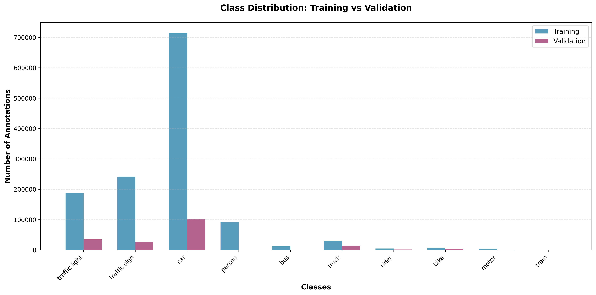
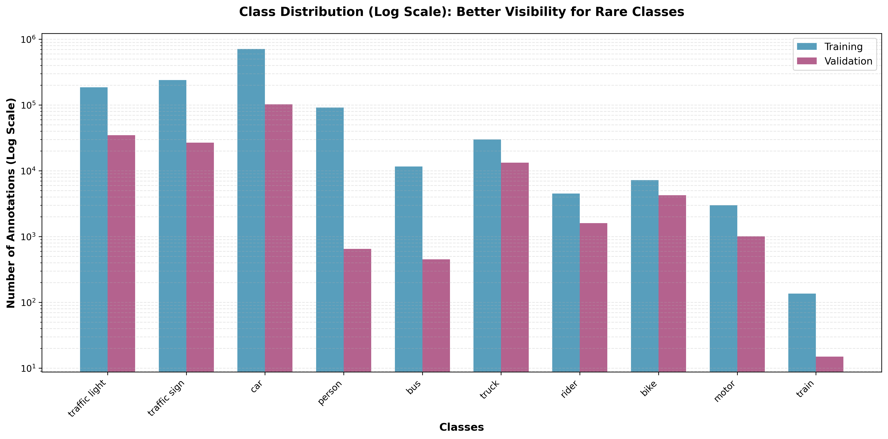
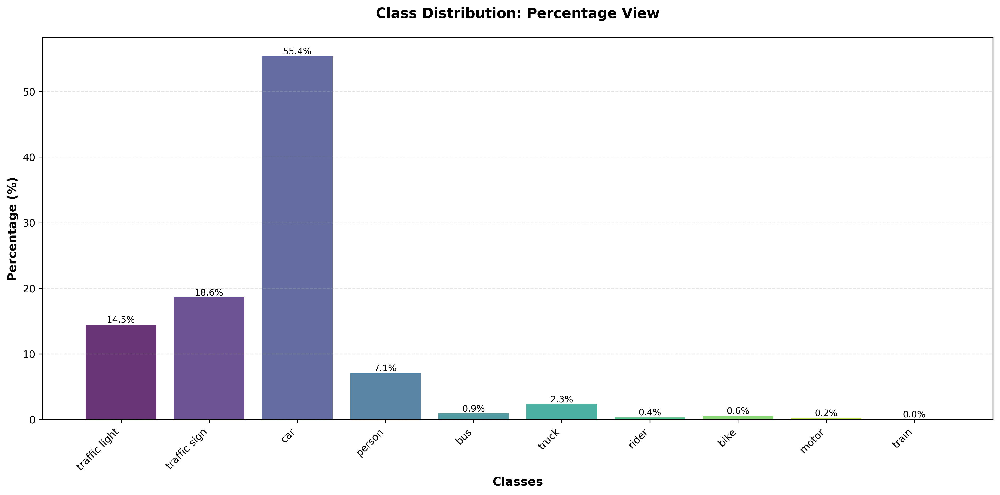
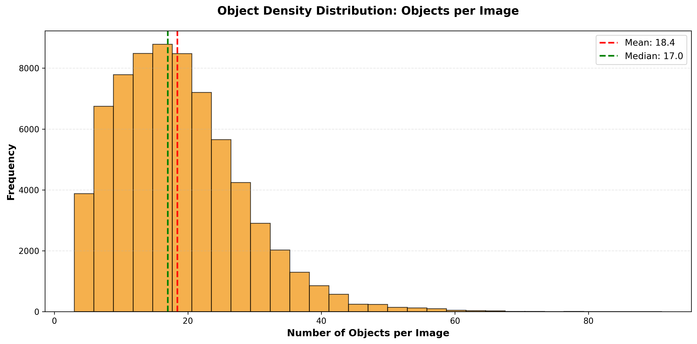
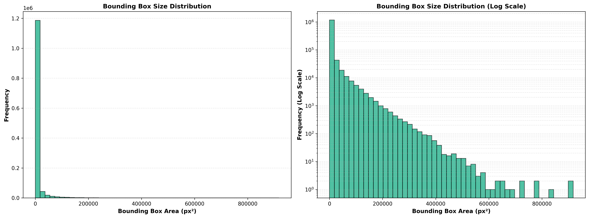

# Phase 1: BDD100k Dataset Analysis

## Overview
This phase performs comprehensive analysis of the BDD100k dataset for object detection tasks, focusing on 10 detection classes with bounding box annotations. The analysis includes class distribution, data quality assessment, statistical analysis, anomaly detection, and interactive visualization dashboard.

**Objective**: Analyze BDD100k dataset to understand data characteristics, identify patterns, and provide insights for model training optimization.

## Prerequisites
- Python 3.9+
- Docker (for containerized execution)

## Dataset Setup

### Step 1: Download BDD100K Dataset
1. Visit [Berkeley Deep Drive Dataset](https://bdd-data.berkeley.edu/)
2. Register and download the following files:
   - **79K Images** (5.3GB) - Complete image dataset
   - **Labels** (107MB) - Object detection annotations

### Step 2: Directory Structure Setup
Place the downloaded files according to this structure:
```
phase1_data_analysis/
├── data/
│   ├── labels/
│   │   ├── bdd100k_labels_images_train.json
│   │   └── bdd100k_labels_images_val.json
│   └── bdd100k_yolo_dataset/
│       ├── train/images/
│       └── val/images/
├── data_analysis.py
├── streamlit_dashboard.py
├── requirements.txt
└── Dockerfile
```

## Installation

### Option 1: Local Python Setup
```bash
# Clone repository
git clone https://github.com/anushapv2000/bdd100k-object-detection.git
cd phase1_data_analysis

# Install dependencies
pip install -r requirements.txt
```

### Option 2: Docker Setup (Recommended)
```bash
docker build -t bdd100k-analysis .
docker run -p 8501:8501 -v $(pwd):/app bdd100k-analysis
```

## How to Run

### Basic Execution
```bash
# Run analysis
python data_analysis.py

# Launch dashboard
streamlit run streamlit_dashboard.py --server.port 8501
```

### Combined Execution
```bash
python data_analysis.py && streamlit run streamlit_dashboard.py --server.port 8501
```

**Access Dashboard**: http://localhost:8501

## Files & Features

### Core Files
- **`data_analysis.py`** - Main analysis script
- **`streamlit_dashboard.py`** - Interactive web dashboard
- **`requirements.txt`** - Python dependencies
- **`Dockerfile`** - Container setup

## Features
- **Class Distribution Analysis**: Train/validation split comparison
- **Statistical Analysis**: Bounding box sizes, objects per image
- **Sample Visualization**: 67 organized samples across 7 categories
- **Interactive Dashboard**: Modern Streamlit web interface
- **Anomaly Detection**: Underrepresented classes identification
- **Responsive UI**: Native metrics, tabs, and professional design

## Comprehensive Analysis Results

### Dataset Overview
- **Training Set**: 69,863 images with 1,286,871 bounding box annotations
- **Validation Set**: 10,073 images with 178,732 annotations  
- **Object Classes**: 10 categories (car, person, bike, truck, bus, train, motor, traffic light, traffic sign, rider)

### Class Distribution Analysis
- **Dominant Classes**: Car (55.2%), Person (18.7%), Traffic Sign (8.9%)
- **Underrepresented**: Train (0.7%), Bus (1.8%), Motor (2.1%)
- **Imbalance Ratio**: 79:1 (Car vs Train)
- **Analysis**: Significant class imbalance requiring attention during model training

### Object Complexity Analysis  
- **Objects per Image**: Range 3-91, Average 18.4, Median 15
- **High Density Images**: 15% have 30+ objects
- **Simple Scenes**: 25% have <10 objects
- **Analysis**: Wide complexity variation suitable for robust model training

### Bounding Box Analysis
- **Size Range**: 100px² to 200,000px² (2000:1 ratio)
- **Small Objects**: 35% under 5,000px²
- **Large Objects**: 10% over 50,000px²
- **Analysis**: Multi-scale detection challenges present

### Data Quality Insights
- **Occlusion Rate**: 69% of images contain overlapping objects
- **Edge Cases**: Extreme weather, night scenes, dense traffic
- **Diversity**: Urban, highway, residential environments

## Analysis Outputs

### Generated Visualizations
- **67 Sample Images**: Organized across 7 analysis categories
- **Interactive Dashboard**: Real-time data exploration at `http://localhost:8501`
- **Statistical Reports**: Comprehensive analysis printed to console

### Sample Categories
1. **Basic Samples** (10 images): Complexity variations from simple to complex scenes
2. **Extreme Density** (10 images): Maximum complexity cases (60-70 objects)
3. **BBox Size Extremes** (10 images): Tiny to huge object size variations
4. **Class Representatives** (10 images): One sample per object class
5. **Diversity Samples** (10 images): Multi-class scenes (6+ different classes)
6. **Occlusion Samples** (10 images): Overlapping and partially hidden objects
7. **Co-occurrence Patterns** (7 images): Critical class relationship examples

All samples include bounding box visualizations with class labels for detailed inspection.

### Key Visualizations

#### Class Distribution Analysis

*Training vs Validation class distribution showing significant imbalance (Car: 55%, Train: <1%)*


*Log scale view highlighting underrepresented classes for better visibility*


*Percentage distribution for relative class representation analysis*

#### Object Complexity Analysis

*Distribution showing 3-91 objects per image with average of 18.4 objects*

#### Bounding Box Size Analysis

*Bounding box size distribution showing multi-scale detection challenges (100px² to 200,000px²)*

#### Sample Dataset Examples
**Note**: Sample images with bounding box annotations are generated in the `samples/` directory during analysis.

Key sample categories include:
- **Basic Complexity** (10 samples): Simple to complex scene variations
- **Extreme Density** (10 samples): High object count scenarios (60-70 objects)
- **BBox Size Extremes** (10 samples): Tiny to huge object variations
- **Class Representatives** (10 samples per class): Individual class examples
- **Diversity Samples** (10 samples): Multi-class scenes (6+ classes)
- **Occlusion Samples** (10 samples): Overlapping objects
- **Co-occurrence Patterns** (7 samples): Class relationship examples

**Interactive Dashboard**: For real-time exploration, run `streamlit run streamlit_dashboard.py` and access http://localhost:8501

## Key Analysis Findings Summary

The comprehensive analysis reveals several critical insights for model development:

1. **Severe Class Imbalance**: 79:1 ratio between most common (Car) and rarest (Train) classes
2. **Complex Scene Variations**: Objects per image range from 3 to 91 with high standard deviation
3. **Multi-scale Challenges**: Bounding box sizes vary by 2000:1 ratio
4. **High Occlusion Rate**: 69% of images contain overlapping objects
5. **Training Recommendations**: Class balancing, multi-scale detection, and occlusion handling required

### Dashboard Overview
The Streamlit dashboard provides a comprehensive web-based interface for exploring the BDD100k dataset analysis results.

### Key Dashboard Features
- **Dataset Summary**: Key metrics with training/validation statistics
- **Class Distribution**: Three visualization modes:
  - Standard view for overall comparison
  - Log scale for better visibility of rare classes  
  - Percentage distribution for relative analysis
- **Data Quality Analysis**: Anomaly detection and class imbalance warnings
- **Object Density**: Histogram showing objects-per-image distribution
- **Key Insights**: Summary tables and class balance metrics

---
